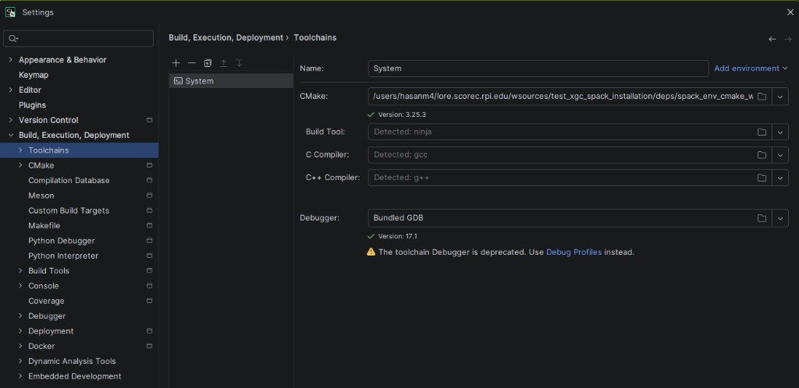
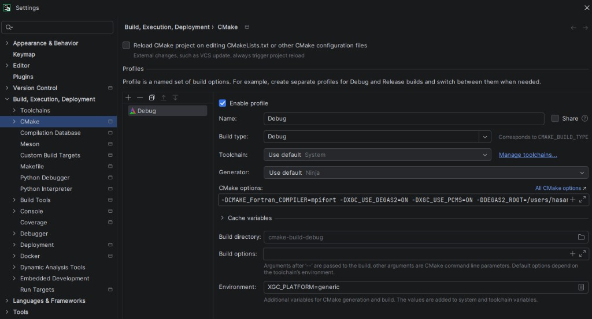

CMake projects with many dependencies are straightforward to configure from a terminal — you load your environment (Spack, modules, etc.) and run `cmake`. CLion, however, invokes `cmake` from its own process, which does not inherit your shell environment. Manually adding paths like `CMAKE_PREFIX_PATH` in the CMake settings rarely captures everything and quickly becomes tedious.

A reliable workaround is to replace CLion's `cmake` binary with a thin **wrapper script** that sets up the environment first.

## 1. Write a CMake Wrapper Script

Create a shell script on the machine where CLion will run CMake. The script should source your environment setup and then forward the original CMake invocation:

```bash
#!/bin/bash
# Load your environment — adapt this section to your setup.
# Examples: source a Spack env, load modules, export variables, etc.
. ~/.bashrc
load-spack                        # initialize Spack
spack env activate my-project-env # activate the relevant environment
spack load cmake                  # ensure cmake is on PATH

# Forward the full CMake command that CLion passes in
exec cmake "$@"
```

Make it executable:

```bash
chmod +x /path/to/cmake_env_wrap.sh
```

> Adjust the environment setup lines to match your project. You can source module files, activate Conda/venv environments, export variables, or run any shell commands needed before CMake.

## 2. Set the Wrapper as CLion's CMake Executable

Open **Settings → Build, Execution, Deployment → Toolchains** and replace the default CMake path with the full path to your wrapper script.



## 3. Configure the CMake Profile

Open **Settings → Build, Execution, Deployment → CMake** and set up your build profile (build type, options, build directory, etc.) as you normally would. Because the toolchain now points to the wrapper, CLion will automatically load your environment every time it invokes CMake.



## How It Works

CLion calls the binary specified in the Toolchain's CMake field for every configure, build, and reload operation. By pointing it to a wrapper script, the full shell environment — compilers, flags, `CMAKE_PREFIX_PATH`, `PKG_CONFIG_PATH`, library paths, and any other variables — is available to CMake exactly as it would be in a terminal session.
